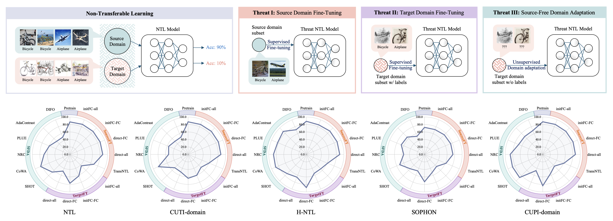
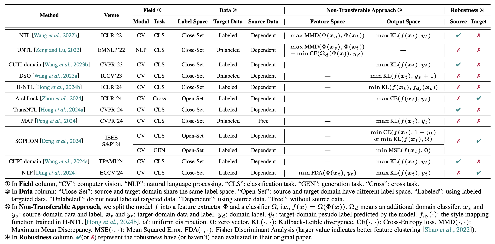

# Toward Robust Non-Transferable Learning: A Survey and Benchmark

[](https://arxiv.org/abs/2502.13593)
[](https://github.com/sindresorhus/awesome)

Over the past decades, researchers have primarily focused on improving the generalization abilities of models, with limited attention given to regulating such generalization. However, the ability of models to generalize to unintended data (e.g., harmful or unauthorized data) can be exploited by malicious adversaries in unforeseen ways, potentially resulting in violations of model ethics. **Non-transferable learning (NTL)**, a task aimed at reshaping the generalization abilities of deep learning models, was proposed to address these challenges. While numerous methods have been proposed in this field, a comprehensive review of existing progress and a thorough analysis of current limitations remain lacking. 

We bridge this gap by 👉 presenting the [first comprehensive survey](https://github.com/tmllab/NTLBench/tree/main?tab=readme-ov-file#survey) on NTL and 👉 introducing [NTLBench](https://github.com/tmllab/NTLBench/tree/main?tab=readme-ov-file#ntlbench), the first benchmark to evaluate NTL performance and robustness within a unified framework. 



🧐 This figure shows the comparison of 5 methods (<font color="#7884AC">NTL</font>, <font color="#7884AC">CUTI-domain</font>, <font color="#7884AC">H-NTL</font>, <font color="#7884AC">SOPHON</font>, <font color="#7884AC">CUPI-domain</font>) on CIFAR \& STL with VGG-13, where we evaluate non-transferability performance and post-training robustness against 5 <font color="#E4785F">source domain fine-tuning (SourceFT)</font> attacks, 4 <font color="#8151BA">target domain fine-tuning (TargetFT)</font> attacks, and 6 <font color="#59A4B7">source-free domain adaptation (SFDA)</font> attacks (higher value means better performance/robustness). 


## Survey

📌 We are actively tracking and updating the latest research about NTL. 
- **IP-CLIP** (CVPR 2025): [Vision-Language Model IP Protection via Prompt-based Learning](https://arxiv.org/pdf/2503.02393)
- **JailNTL** (CVPR 2025): [Jailbreaking the Non-Transferable Barrier via Test-Time Data Disguising](https://github.com/tmllab/2025_CVPR_JailNTL)
- **NTP** (ECCV 2024): [Non-transferable Pruning](https://arxiv.org/pdf/2410.08015)
- **CUPI-domain** (TPAMI 2024): [Say No to Freeloader: Protecting Intellectual Property of Your Deep Model](https://arxiv.org/pdf/2408.13161)
- **SOPHON** (IEEE S&P 2024): [SOPHON: Non-Fine-Tunable Learning to Restrain Task Transferability For Pre-trained Models](https://arxiv.org/pdf/2404.12699)
- **MAP** (CVPR 2024): [MAP: MAsk-Pruning for Source-Free Model Intellectual Property Protection](https://openaccess.thecvf.com/content/CVPR2024/papers/Peng_MAP_MAsk-Pruning_for_Source-Free_Model_Intellectual_Property_Protection_CVPR_2024_paper.pdf)
- **TransNTL** (CVPR 2024): [Your Transferability Barrier is Fragile: Free-Lunch for Transferring the Non-Transferable Learning](https://openaccess.thecvf.com/content/CVPR2024/papers/Hong_Your_Transferability_Barrier_is_Fragile_Free-Lunch_for_Transferring_the_Non-Transferable_CVPR_2024_paper.pdf)
- **ArchLock** (ICLR 2024): [ArchLock: Locking DNN Transferability at the Architecture Level with a Zero-Cost Binary Predictor](https://openreview.net/pdf?id=e2YOVTenU9)
- **H-NTL** (ICLR 2024): [Improving non-transferable representation learning by harnessing content and style](https://openreview.net/pdf?id=FYKVPOHCpE)
- **DSO** (ICCV 2023): [Domain Specified Optimization for Deployment Authorization](https://openaccess.thecvf.com/content/ICCV2023/papers/Wang_Domain_Specified_Optimization_for_Deployment_Authorization_ICCV_2023_paper.pdf)
- **CUTI-domain** (CVPR 2023): [Model barrier: A compact un-transferable isolation domain for model intellectual property protection](https://openaccess.thecvf.com/content/CVPR2023/papers/Wang_Model_Barrier_A_Compact_Un-Transferable_Isolation_Domain_for_Model_Intellectual_CVPR_2023_paper.pdf)
- **UNTL** (EMNLP 2022): [Unsupervised Non-transferable Text Classification](https://arxiv.org/pdf/2210.12651)
- **NTL** (ICLR 2022): [Non-Transferable Learning: A New Approach for Model Ownership Verification and Applicability Authorization](https://arxiv.org/pdf/2106.06916)

👇 Summary of NTL methods according to **Field** (modal, task), **Data** (label space, target supervision, source data dependent), **Non-Transferable Approach** (feature or output space), and **Robustness** (whether source and target domain robustness have been evaluated). 📝 More details please refer to our paper [[arXiv](https://arxiv.org/abs/2502.13593)].




## NTLBench

NTLBench is the first benchmark for **non-transferable learning** (NTL), which contains a standard and unified training and evaluation process. NTLBench supports **5 SOTA NTL methods**, **9 datasets** (more than 116 domain pairs), **5 network architectures families**, and **15 post-training attacks** from 3 attack settings, providing **more than 40,000** experimental configurations.

### Components
- [x] **NTL Training**
  - [x] `NTL` (ICLR 2022) [[Paper](https://arxiv.org/pdf/2106.06916)][[Code](https://github.com/conditionWang/NTL)]
  - [x] `CUTI-domain` (CVPR 2023) [[Paper](https://openaccess.thecvf.com/content/CVPR2023/papers/Wang_Model_Barrier_A_Compact_Un-Transferable_Isolation_Domain_for_Model_Intellectual_CVPR_2023_paper.pdf)][[Code](https://github.com/LyWang12/CUTI-Domain)]
  - [x] `H-NTL` (ICLR 2024) [[Paper](https://openreview.net/pdf?id=FYKVPOHCpE)][[Code](https://github.com/tmllab/NTLBench)]
  - [x] `SOPHON` (IEEE S&P 2024) [[Paper](https://arxiv.org/pdf/2404.12699)][[Code](https://github.com/ChiangE/Sophon)]
  - [x] `CUPI-domain` (T-PAMI 2024) [[Paper](https://arxiv.org/pdf/2408.13161)][[Code](https://github.com/LyWang12/CUPI-Domain)] 
- [x] **Source Domain Fine-Tuning**
  - [x] Fine-tuning Strategies (`initFC-all`, `initFC-FC`, `direct-FC`, `direct-all`)
  - [x] `TransNTL` (CVPR 2024) [[Paper](https://openaccess.thecvf.com/content/CVPR2024/papers/Hong_Your_Transferability_Barrier_is_Fragile_Free-Lunch_for_Transferring_the_Non-Transferable_CVPR_2024_paper.pdf)][[Code](https://github.com/tmllab/2024_CVPR_TransNTL)]
- [x] **Target Domain Fine-Tuning**
  - [x] Fine-tuning Strategies (`initFC-all`, `initFC-FC`, `direct-FC`, `direct-all`)
- [ ] **Source-Free Domain Adaptation** (coming soon 🤓)
  - [ ] `SHOT` (ICML 2020)
  - [ ] `CoWA` (ICML 2022)
  - [ ] `NRC` (NeurIPS 2021)
  - [ ] `PLUE` (CVPR 2023)
  - [ ] `AdaContrast` (CVPR 2022)
  - [ ] `DIFO` (CVPR 2024)

### Quickstart

#### 1. Installation
Clone the repository:
```
git clone https://github.com/tmllab/NTLBench.git
cd NTLBench
```
Install dependencies:

```
pip install -r requirements.txt
```

#### 2. Preparing Data
Download datasets:
```
mkdir ./data/
python data_download.py --data_dir ./data/
```
Pre-split the dataset into training/validation/testing sets:
```
python data_split.py
```
This will create and split datasets to the `./data_presplit` folder.

We currently support `Digits` (MNIST, USPS, SVHN, MNIST-M, SYND), `RMNIST`, `CIFAR/STL`, `VisDA` (VisDA-T, VisDA-V), `OfficeHome`, `DomainNet`, `VLCS`, `PACS`, and `Terra Incognita`.

#### 3. Training NTL

You can pre-train SL or NTL models from scratch by running:
```
python NTL_pretrain.py
```

#### 4. Attack NTL Models

##### 4.1 Source Domain Fine-Tuning
Please run the `NTL_postattack_src.py` to evaluate the robustness of each NTL method. You can select the fine-tuning attack or the SOTA attack `TransNTL`.
```
python NTL_postattack_src.py
```

##### 4.2 Target Domain Fine-Tuning
Please run the `NTL_postattack_tgt.py` to evaluate the robustness of each NTL method against target domain fine-tuning. You can select the fine-tuning attack under the assumption that the attacker can access parts of labeled target domain data.
```
python NTL_postattack_tgt.py
```

##### 4.3 Source-Free Domain Adaptation
Please also run the `NTL_postattack_tgt.py` to evaluate the robustness of each NTL method against SFDA methods using **unlabeled** target domain. You can select the fine-tuning attack under the assumption that the attacker can access parts of unlabeled target domain data.
```
python NTL_postattack_tgt.py
```


## Citation
If you find this work useful in your research, please consider citing our paper:
```
@article{hong2025toward,
  title={Toward Robust Non-Transferable Learning: A Survey and Benchmark},
  author={Hong, Ziming and Xiang, Yongli and Liu, Tongliang},
  journal={arXiv preprint arXiv:2502.13593},
  year={2025}
}
```

## Acknowledgement
Parts of this project were inspired by the following projects. We thank their contributors for their excellent work: 
- https://github.com/conditionWang/NTL
- https://github.com/LyWang12/CUTI-Domain
- https://github.com/ChiangE/Sophon
- https://github.com/LyWang12/CUPI-Domain
- https://github.com/tmllab/2024_CVPR_TransNTL
- https://github.com/tntek/source-free-domain-adaptation
- https://github.com/facebookresearch/DomainBed
- https://github.com/zju-vipa/CMI